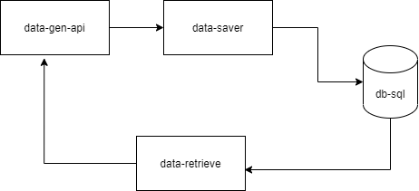

# TP-Hello-DevOps

This solution is a test solution with several microservices that tries
to create a ring of services to test multiple elements of the DevOps technilogy.

Can do docker-compose build and docker-compose push

aws get kubeonfug
aws sts get-caller-identity
aws eks --region eu-west-1 update-kubeconfig --name tp-cluster